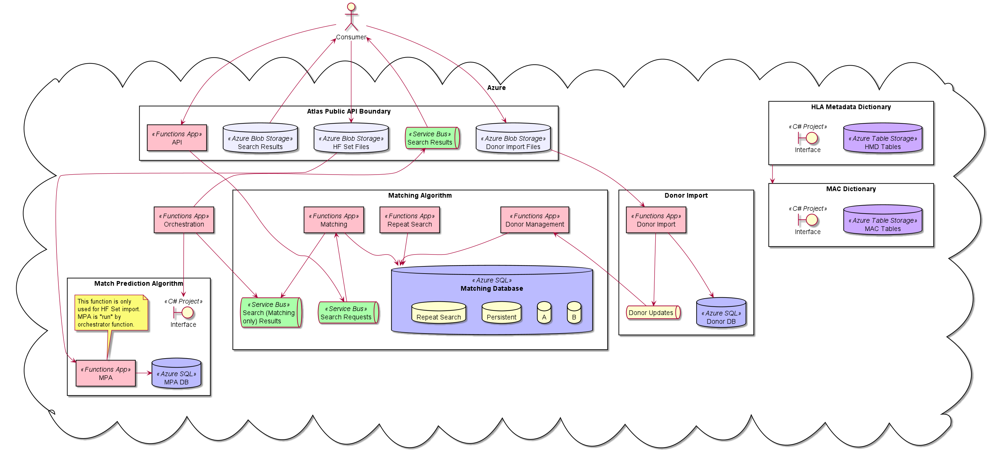

## Architecture Diagrams

Diagrams have been written in [Plant UML](http://plantuml.com/), stored in the `source-diagrams` folder.

Whenever any diagram is updated, a snapshot should be taken (e.g. via [PlantText](https://www.planttext.com/)) to replace
 the one stored in `generated-diagrams`, and the snapshot time in the README updated. 
 
 ### Atlas Overview
 
 